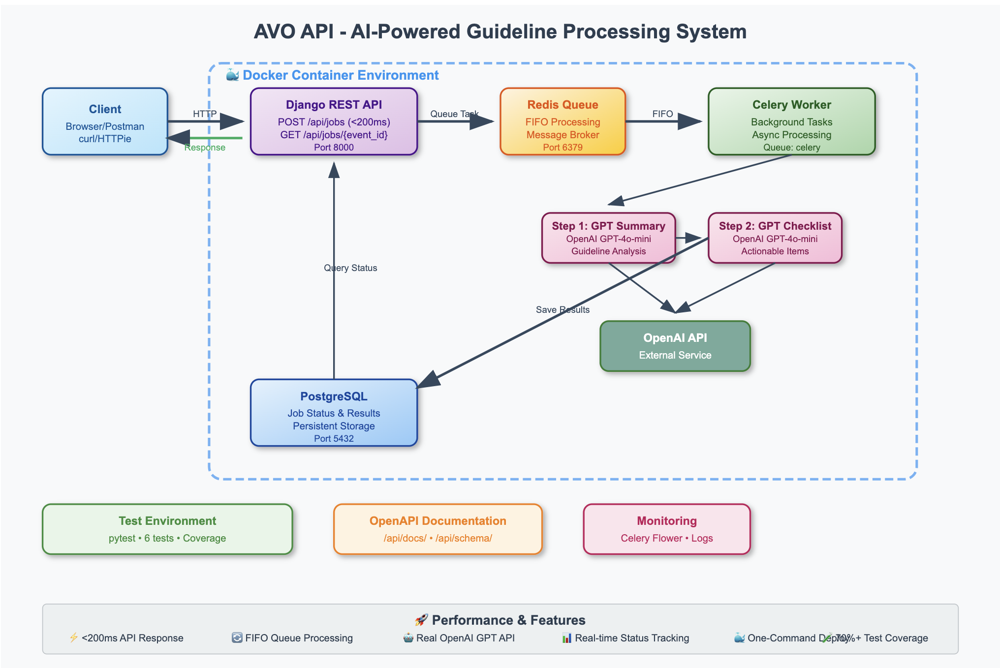
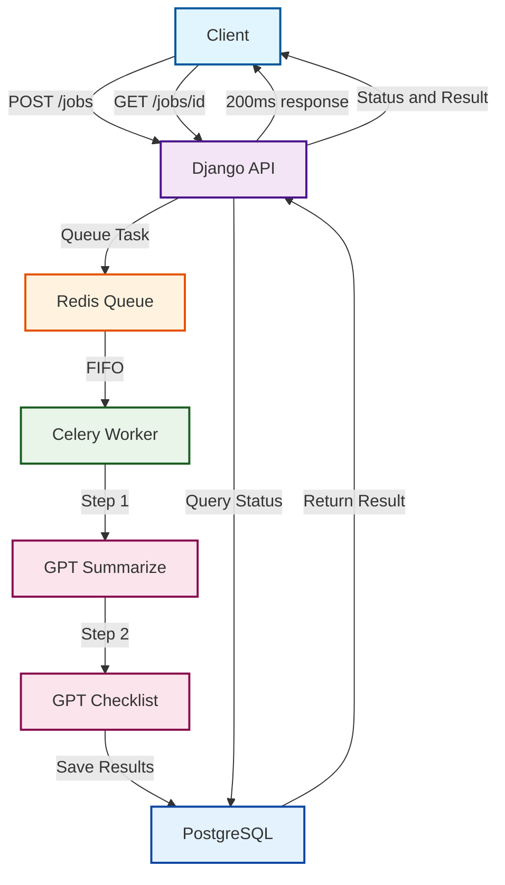

# AVO API - AI-Powered Guideline Processing

[](https://opensource.org/licenses/MIT)
[](https://www.python.org/downloads/)

> Minimal backend API for automated guideline processing with AI-powered summarization and checklist generation.

## System Architecture



## Quick Start
```bash
# Clone and start services
git clone <repo-url>
cd avo-api
docker compose up --build

# Run tests
docker compose --profile test run test

# API Documentation
http://localhost:8000/api/docs/
```

## API Endpoints
- `POST /api/jobs` → Returns `event_id` in <200ms
- `GET /api/jobs/{event_id}` → Job status and results
- `GET /api/schema/` → OpenAPI specification
- `GET /api/docs/` → Interactive documentation

## Design Choices

**Tech Stack**: Django + Celery + Redis + PostgreSQL for:
- **Sub-200ms response**: Immediate job queuing with async processing
- **FIFO guarantee**: Redis queues ensure order preservation
- **Scalability**: Horizontal worker scaling with Celery
- **Reliability**: PostgreSQL for persistent job state

**Two-Stage GPT Chain**:
1. **Summarize** guidelines using GPT-4o-mini
2. **Generate** actionable checklist from summary

**AI Tools Used**:
- **Claude**: Architecture design, code structure, and comprehensive testing
- **Mermaid**: System architecture diagram generation
- **OpenAPI**: Automatic API documentation generation
- **GPT Integration**: Content processing pipeline optimization

Built with AI assistance for rapid development and deployment.